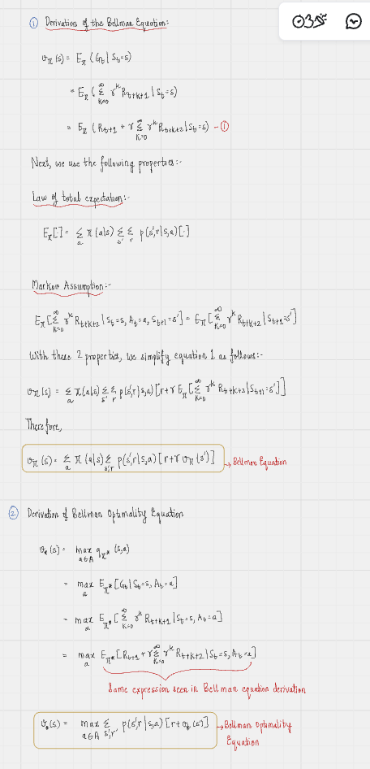

# Reinforcement Learning Basics

Policy - Defines the behaviour of the agent and it's interaction with the environment. 

Reward Signal - Maximizes the short term success 

Value Function - Maximizes the long term success

Model - Sometimes environment can be complex so we use some mathematical models to simulate the agentic system. 

# Multi-arm bandit problem 

It is toy example of compex reinforcement learning problems. It is modelled as multi-lever game where pulling one particular lever increases the probability of winning, however we need to find that lever and we don't have initial states. 

Value action method - In this method, the agent interacts with environment, we reward it on the basis of correct action. We see the long term behaviour of the value action for each lever and that's how we get the expected probability to choose the best lever. 

qi(a) = 1 if you win
qi(a) = 0 if you lose

This can also be linked to average law over large numbers since we tend to get the estimation of most probable winner with large number of interactions. Note - we do not use greedy search i.e. we do not always choose the most probable rewarding lever during interactions since it can leave us with a local minima. 
We use exploration and exploitation. 
At the end, 

qi(a) = (average over t)qit(at)

we get all the average value action for each lever i.e. the probability of most rewarding lever. 

# Markov Decision process

 - Agent-Environment Interface -
 State - Tells about the state of the system like temperature, energy level, etc. 
 Action - Immediate task/action that agent should do 
 Policy - Action that needs to be done by the system depending on the state. /pi(a|s)

- Rewards and Expected Returns
Rewards - Immediate rewards (rt) given to the agent depending on the action  taken at time step t
Expected returns - Average of all the rewards from time step t to end time step T (gt = rt + r_{t+1} + .. + r_T)

This gives rise to model problems in two ways 

- Episodic - In this, you know the time step at which agent stops interacting  like chess. 
- Continuous - We don't know the time at which agent stops interacting such as in exploration task where you continuosly try to find information. Therefore, in continuous system, we try to decrease the importance of reward from future in the expected return by introducing an exponetial decreasing term \gamma as a factor. 
G_t = /sum_{k = 0}{/infinity}\gammaˆkR_{t+k}

- Markov Property
This says rewards just depend on the previous state i.e. the future depends on the present and not the past.  
P(S_{t+1}, R_t| S_t, A_t) =  P(S_{t+1}, R_t| S_0, A_0, S_1, A_1, .. , S_t, A_t)

- Markov Decision Processes
Any reinforcement learning task which has markov property, is called markov decision process. 

# Value Functions

State value function - It tells about the expected return at the state to the future states. 

v_{/pi} = E_{\pi}(G(t) | S) = E_{\pi}(\sum_{k = 0}{\infinity}\gamma_{k}R_{t+k}| S)
Action value function - It tells about the expected return at the state to the future states, given some action taken. 
a_{/pi} = E_{\pi}(G(t) | S, A) = E_{\pi}(\sum_{k = 0}{\infinity}\gamma_{k}R_{t+k}| S, A)

Bellman equation for optimal value function 

v_{\pi}(s) = \sum_{A}P(\pi(A|S) \sum_{s', r} P(S', r|S, A) (r + \gamma v_{\pi}(s')))

Optimal policy (or optimal action value function)

v_{*}(s) = max_{A} \sum_{s', r} P(S', r|S, A) (r + \gamma v_{*}(s'))

# Bellman derivation 

