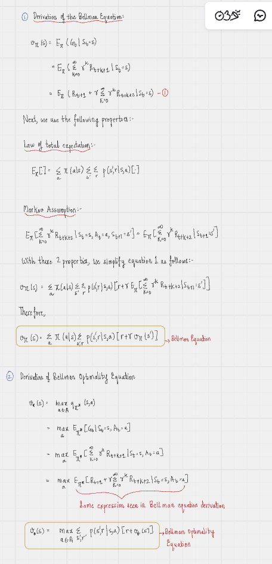
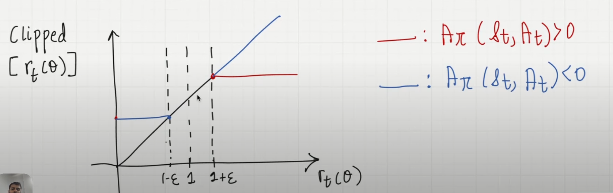
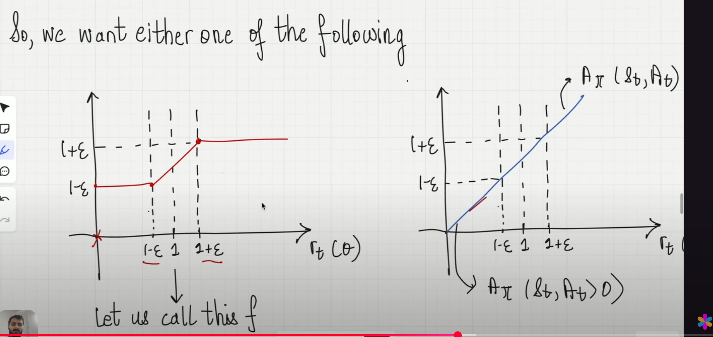

# Reinforcement Learning Basics

Policy - Defines the behaviour of the agent and it's \interaction with the environment. 

Reward Signal - Maximizes the short term success 

Value Function - Maximizes the long term success

Model - Sometimes environment can be complex so we use some mathematical models to simulate the agentic system. 

# Multi-arm bandit problem 

It is toy example of compex reinforcement learning problems. It is modelled as multi-lever game where pulling one particular lever \increases the probability of winning, however we need to find that lever and we don't have \initial states. 

Value action method - \in this method, the agent \interacts with environment, we reward it on the basis of correct action. We see the long term behaviour of the value action for each lever and that's how we get the expected probability to choose the best lever. 

$q_i(a)$ = 1 if you win
#q_i(a)$ = 0 if you lose

This can also be linked to average law over large numbers since we tend to get the estimation of most probable winner with large number of \interactions. Note - we do not use greedy search i.e. we do not always choose the most probable rewarding lever during \interactions since it can leave us with a local minima. 
We use exploration and exploitation. 
At the end, 

qi(a) = (average over t)qit(at)

we get all the average value action for each lever i.e. the probability of most rewarding lever. 

# Markov Decision process

 - Agent-Environment \interface -
 State - Tells about the state of the system like temperature, energy level, etc. 
 Action - Immediate task/action that agent should do 
 Policy - Action that needs to be done by the system depending on the state. /pi(a|s)

- Rewards and Expected Returns
Rewards - Immediate rewards (rt) given to the agent depending on the action  taken at time step t
Expected returns - Average of all the rewards from time step t to end time step T (gt = rt + r_{t+1} + .. + r_T)

This gives rise to model problems \in two ways 

- Episodic - \in this, you know the time step at which agent stops \interacting  like chess. 
- Continuous - We don't know the time at which agent stops \interacting such as \in exploration task where you continuosly try to find \information. Therefore, \in continuous system, we try to decrease the importance of reward from future \in the expected return by \introducing an exponetial decreasing term \gamma as a factor. 
G_t = /sum_{k = 0}{/infinity}\gammaˆkR_{t+k}

- Markov Property
This says rewards just depend on the previous state i.e. the future depends on the present and not the past.  
P(S_{t+1}, R_t| S_t, A_t) =  P(S_{t+1}, R_t| S_0, A_0, S_1, A_1, .. , S_t, A_t)

- Markov Decision Processes
Any reinforcement learning task which has markov property, is called markov decision process. 

# Value Functions

State value function - It tells about the expected return at the state to the future states. 

v_{/pi} = E_{\pi}(G(t) | S) = E_{\pi}(\sum_{k = 0}{\infinity}\gamma_{k}R_{t+k}| S)
Action value function - It tells about the expected return at the state to the future states, given some action taken. 
a_{/pi} = E_{\pi}(G(t) | S, A) = E_{\pi}(\sum_{k = 0}{\infinity}\gamma_{k}R_{t+k}| S, A)

Bellman equation for optimal value function 

v_{\pi}(s) = \sum_{A}P(\pi(A|S) \sum_{s', r} P(S', r|S, A) (r + \gamma v_{\pi}(s')))

Optimal policy (or optimal action value function)

v_{*}(s) = max_{A} \sum_{s', r} P(S', r|S, A) (r + \gamma v_{*}(s'))

# Bellman derivation 

# Dynamic Programming 

## Prediction problem 
- Policy Evaluation - For a given policy and state, policy evaluation is written as v_{\pi}(s) which tells about values returned by that policy. 

v_{\pi}(s) = \sum_a \pi(a|s) \sum_{s', r} p(S', R|S, A)(r + \gamma*v_{\pi}(S'))

To find the state value function, we usually start with zero, and iterate to \infinity to find the correct state values. 

v_{k+1} = \sum_{a} \pi(a|s) \sum_{S', R} p(S', R|S, A) (R + \gamma v_{k}(s'))

So called Iterative policy evaluation 

## Control Problem
- Policy optimization 

\pi = argmax_{a} \sum_{S', R} p(S', R| S, A) (R + \gamma v_{k}(S'))

v_{*} (s) = max_{a \epsilon A} q_{\pi^{*}}(s, a)
= max_{a \epsilon A} \sum_{S', R} p(S', R|S, A) (R + \gamma v_{*}(s'))

v_{k+1} (s) = max_{a \epsilon A}  \sum_{S', R} p(S', R|S, A) (R + \gamma v_{k}(s'))

This method is called as value iteration. It reduces the 2 step of policy evaluation and policy iteration \into one single step. 

Policy iteration 
\pi_{0} -> v_{\pi_{0}}
v_{\pi_{0}} -> \pi_{1}

Dynamic programming requires the prior knowledge of the environment and it's \interaction with the environment i.e. transition probabilities. 

# Monte Carlo methods 

In dynamic programming, we need to know all the transition probabilities i.e. know about the environment but this is not ideal \in real life cases. Therefore, we require a mathematical tool that helps to identify the optimal policy while \interacting with environment and not knowing probabilities of agent \interacting with environment. \in Monte Carlo, agent continuously \interacts with environment and updata it's action value function. After several trials, we reach an optimal action value function and hence optimal policy. 

\pi_{0} -> q_{\pi_{0}}(S, A)
q_{\pi_{0}}(S, A) -> \pi_{1}

However, \in this case, there might be a case our agent might be stuck with some kind of local mazima. Therefore, we use epsilon greedy policy which allows exploration and not just exploitation. 

There are two kinds of Monte Carlo methods - 
On-policy - The policy with which agent \interacts to generate data is same as the target policy. 

Off-policy - The policy with which agent \interacts to generate data, known as behaviour policy is different from target policy. (Need to understand more!!!)

Interactive Example to demonstrate on-policy Monte-Carlo control: [link](https://claude.ai/public/artifacts/1e531122-1b45-4337-86a2-df8bc2ac531b)

Interactive Example to demonstrate Importance Sampling Ratio used \in off-policy Monte-Carlo methods (not the focus of this lecture): [link](https://claude.ai/public/artifacts/8a773548-d360-418b-a20b-d427dc7a1952)

# Temporal difference learning

It is a combination of dynamic programming and monte carlo methods, which gives the benefit of not knowing the \interaction with environment and not need to wait for the whole episode to complete. 

## Prediction problem 

### Monte Carlo method 

From Monte Carlo method, we know how to calculate the state value function 

We calculate state value function 
V_{k+1}(S) =\frac{G_0 + G_1 + G_2 + ... + G_{k-1} + G_{k}}{k+1}

V_{k+1}(S) = V_k(S) + \alpha*(G_k - V_k(S))

V(S_{t+1}) = V(S_t) + \alpha*(G_t - V(S_t))

V(S_t) = V(S_t) + \alpha*((R_{t-1} + R_t + R_{t+1} + ...) - V(S_t))

However, we can't wait for the episode to end. 

### Dynamic programming
Therefore, we used the concepts from dynamic programming (bootstrapping) to estimate the state value function as a function of immediate state value function

G_t = R_{t+1} + \gamma( R_{t+2} + ...)
G_t = R_{t+1} + \gamma (V(S_{t+1}))

So now the prediction problem looks like 
V(S_{t+1}) = V(S_t) + \alpha*(( R_{t+1} + \gamma (V(S_{t+1}))) - V(S_t))

Now, we don't need to wait for the whole episode to be over. 

## Control Problem

If we want to prediction the value of state-action pair, we calculate state action value Q(S, A). 

### On-Policy Control

If the agent applies the policy with which it has learnt, it's called on-policy. For example, a person rides a bicycle and improves it's skill while driving. 

\textbf(SARSA Algorithm)
Q(S_t, A_t) = Q(S_t, A_t) + \alpha (( R_{t+1} + \gamma (Q(S_{t+1}, A_{t+1}))) - Q(S_t, A_t))

### Off-policy control 
If the agent applies the different policy with which it learnt. For example - It learns by epsilon greedy policy but \interacts with environment by greedy policy. 
It's like a person who learns from expert but applies his skills while actually riding the bike. 

\textbf(Q-Learning)
Q(S_t, A_t) = Q(S_t, A_t) + \alpha ((R_t + argmax_a Q(S_{t+1}, A_{t+1})) - Q(S_t, A_t))

Google Colab link for Cliff Walking Problem using SARSA: [link](https://www.youtube.com/redirect?event=video_description&redir_token=QUFFLUhqa1psaWVCd2VKTG9YMzVNQnVXTVpWU1hDb01OQXxBQ3Jtc0tuUG81Mm8xR0RHdlRRU0tIOTJjaVRyOTNZQ1JRUGlKemtVY2RBSHd6NUpBbWQ3eFktcWhDcDFkV3hBTUxLQlhmdGdhTDg5Y2Y0RHM3eUgzU18wdzFQRGFmbUVEbDBLQ1MwVjRTdHhwUFd3MFNLWlU2UQ&q=https%3A%2F%2Fcolab.research.google.com%2Fdrive%2F1XbxqH9eZ6r-TFO6wgQUahICDSHnHbXwN%3Fusp%3Dsharing&v=PfCME1G7hKI)

Google Colab link for Cliff Walking Problem using Q-Learning: [link](https://www.youtube.com/redirect?event=video_description&redir_token=QUFFLUhqbXdTbjE4RFBJaG5GeDBxV25rbFU2U0s4Wm1NZ3xBQ3Jtc0tsUnY3d3pEbkJXSHpFajJyMGl0M09YLVRvQ28wT1VGUVJXMXpPTkNGbGpqdE1nbmFsZGhXMXFvcUd1NGtSamhRM1N3Q3VhVkFaeFVjMm1KTElCemgyeENIcFBMYUJvS0NnVDFJaTA5cXdfSkRSMFBtdw&q=https%3A%2F%2Fcolab.research.google.com%2Fdrive%2F1NaBEZW-pSg8Uezumz1TA2peH1pVjq5qu%3Fusp%3Dsharing&v=PfCME1G7hKI)

# Function Apporximation methods

In most practical cases, the number of states could very large and it would be computationally expensive to train the agent by classical RL. 
Therefore, we require a method where we can approximate the other states by knowing a subset of states. This is very similar to regression problems. 
Here we approximate the value of states by minimizing the loss function. 

w_{t+1} = w_t - \frac{\alpha}{2}\nabla[v_{\pi}(S_t) - \hat{v}(S_t, w_t)]^{2}
w_{t+1} = w_t - \alpha [v_{\pi}(S_t) - \hat{v}(S_t, w_t)] \nabla \hat{v}(S_t, w_t)

From dynamic programming, we know 

G_t = R_{t+1} + \gamma( R_{t+2} + ...) = V(S_t)
w_{t+1} = w_t - \alpha [G_t - \hat{v}(S_t, w_t)] \nabla \hat{v}(S_t, w_t)

or from Monte carlo methods, we can just approximate
V(S_t) = R_{t+1} + V(S_{t+1})

w_{t+1} = w_t - \alpha [R_{t+1} + \gamma hat{v}(S_{t+1},w_t) - \hat{v}(S_t, w_t)] \nabla \hat{v}(S_t, w_t)

This is called semi-gradient method because we do not take \into the account of gradient V(S_{t+1},w_t). 

## Prediction problem 

Apporximating the value functions - 
- Linear methods
- Non-linear methods - Neural networks (Deep Reinforcement Learning)

To find the optimal policy
w_{t+1} = w_t + [(R_{t+1} + \gamma \hat{q}(S', A', w)) - \hat{q}(S, A, w)] \nabla q(S, A, w)

## Control problem

It remains the same.

- \initialize s and for the episode (using \epsilon-greedy policy)
- Loop the following for every step of the episode:
- - Take action a, observe R's 
- - Choose action a' (use \epislon-grredy policy)
- - w_{t+1} = w_t + [(R_{t+1} + \gamma \hat{q}(S', A', w)) - \hat{q}(S, A, w)] \nabla q(S, A, w)

# Policy gradient methods

Can we directly optimize the policy \instead of optimizing the function which serve as a proxy to optimize the policy? 

Here, \instead of finding the optimal function, we parameterize the policy 
\pi(a|s) -> \pi(a|s,\theta)

Therefore, we try to maximize a function which meansures the performance of the policy. 
J(\theta). 
To maximize the performance, we use 'gradient ascent'.

\theta_{t+1} = \theta_t + \alpha \nabla J(\theta)

However, if we think about the dependence of J(\theta), it might depend on both the policy used and the state distribution \introduced by different policy. 
This makes it complicated to differentiate. 

Therefore, we use the results of 'Policy gradient theorem', which provides an analytical expression for gradient of performance metrics w.r.t policy parameter without \including gradient of state distribution w.r.t policy parameter. 

\nabla J(\theta) \propto
\sum_s \underbrace{\mu(s)}_{\text{state distribution}} 
\sum_a \underbrace{q_{\pi}(s,a)}_{\text{action-value function}} 
\underbrace{\nabla \pi(a \mid s, \theta)}_{\text{gradient of policy}}

J(\theta) = \underbrace{v_{\pi}(s_0)}_{\text{value function at \initial state}}

Proof: [link](https://miro.com/app/board/uXjVIsgkBts=/)

## REINFORCE 

We use the concept of expected value from probability 
$ E(f(x)) = xf(x) $

So, 

$$ \nabla J(\theta) \propto E_{\pi}[ \sum_a q_{\pi}(s,a) \nabla \pi(a \mid s, \theta)] $$

This gives 
$$ \theta_{t+1} = \theta_t + \alpha (\sum_a q_{\pi}(s,a) \nabla \pi(a \mid s, \theta)) $$

Now, we can even absorb the summation of action value 

$$ E_{\pi}[ \sum_a q_{\pi}(s,a) \nabla \pi(a \mid s, \theta)] $$ 

$$ = E_{\pi}[ \sum_a \pi(a|s,\theta) q_{\pi}(s,a) \frac{\nabla \pi(a \mid s, \theta)}{\pi(a|s,\theta)}] $$

$$ = E_{\pi}[ E_{\pi} [q_{\pi}(s,a)] \frac{\nabla \pi(a \mid s, \theta)}{\pi(a|s,\theta)}] $$

$$ = E_{\pi}[ q_{\pi}(s,a) \frac{\nabla \pi(a \mid s, \theta)}{\pi(a|s,\theta)}] $$

$$ \nabla J(\theta) \propto E_{\pi}[ q_{\pi}(s,a) \frac{\nabla \pi(a \mid s, \theta)}{\pi(a|s,\theta)}] $$ 

We also know, 

$$ q_{\pi}(s,a) = E(R_{t+1} + \gamma R_{t+2} + ...) = E(G_t) $$

So, 

$$ \nabla J(\theta) \propto E_{\pi}[ G_t \frac{\nabla \pi(a \mid s, \theta)}{\pi(a|s,\theta)}] $$

This gives 
$$ \theta_{t+1} = \theta_t + \alpha (G_t \frac{\nabla \pi(a \mid s, \theta)}{\pi(a|s,\theta)}) $$

## REINFORCE with Baseline

G_t might lead to fluctations, therefore we \introduce a baseline v(s,a) to control variance. 

$$ \theta_{t+1} = \theta_t + \alpha ((G_t - \hat{v}(s,w)) \frac{\nabla \pi(a \mid s, \theta)}{\pi(a|s,\theta)}) $$

## Actor-Critic method

Expected return G_t requires agent to complete the episode. However, we can use the concepts from temporal difference learning to approximate G_t without waiting for the episode to complete. 

$$ \theta_{t+1} = \theta_t + \alpha (((R_{t+1} + \gamma \hat{v}(s_{t+1}, w)) - \hat{v}(s,w)) \frac{\nabla \pi(a \mid s, \theta)}{\pi(a|s,\theta)}) $$

# Generalized Advantage estimation

We define an advantage function which tells about whether there can be improvement \in the current policy. It is give by -

$$ A(s_t, a_t) = q_{\pi}(a_t|s_t) - v_{\pi}(s_t) $$ 

If this is positive, it means there is room for improvement. 

$$ \nabla J(\theta) \propto E_{\pi}[ (q_{\pi}(a|s) - v_{\pi}(s)) \nabla log \pi(a \mid s, \theta)] $$

(using $ \nabla log f(x) = \frac{\nabla f(x)}{f(x)}$)

We can use the definition of action value function 

$$ q_{\pi}(a|s) = E_{\pi} [G_t | s_t, a_t] = E_{\pi} [R_t + \gamma(R_{t+1} + R_{t+1} + ... )] $$ 

$$ q_{\pi}(a|s) = R_t + \gamma E_{\pi} [(R_{t+1} + R_{t+1} + ... )] = R_t + \gamma  v_{\pi}(s_{t+1}) $$ 

This leads to approximate advantage function as 

$$ \hat{A(s_t, a_t)} =  R_t + \gamma  v_{\pi}(s_{t+1}) - v_{\pi}(s_t) $$

However, this is a one step and gives too much preference to the next state. Therefore, to balance and bias, we take the average of n-step. 

$ q_{\pi} $ estimate for 2-step: $ r_t + \gamma r_{t+1} + \gamma^{2} v_{\pi}(s_{t+2}) $
Similarly for n-step

This leads to estimated value as 

$ \hat{A(s_t, a_t)}$ =  $(1-\lambda)$(1-step return) $+ (1-\lambda)\lambda$(2-step return) + ... $(1-\lambda)\lambda^{n-1}$(n-step return) - $v_{\pi}(s_t)$
This is known as Generalized advantage estimation. This method allows us to control the compromise between bias and variance \in the policy gradient methods. 

$$\lambda = 0$$ leads to Temporal difference estimate with high bias and low variance 

$$\lambda = 1$$ leads to Monte Carlo estimate with low bias and high variance

# Trust Region Policy Optimization 

We define performance measure as $n(\pi)$: 

$$ n(\pi) = v_{\pi}(s_o) $$

New policy: 

$$ n(\pi^{'}) = v_{\pi^{'}}(s_o) = E_{\pi^{'}}[\sum_{k=0}^{\infty} \gamma_{k}R(S_t)] = E_{\pi^{'}}[\sum_{k=0}^{\infty} \gamma_{k}R(S_t) - v_{\pi}(s_o) + v_{\pi}(s_o)] $$

$$ n(\pi^{'}) - n(\pi) = E_{\pi^{'}}[\sum_{k=0}^{\infty} \gamma_{k}R(S_t) - v_{\pi}(s_o) + v_{\pi}(s_o)] - v_{\pi}(s_o) $$

$$ n(\pi^{'}) - n(\pi) = E_{\pi^{'}}[\sum_{k=0}^{\infty} \gamma_{k}R(S_t) - v_{\pi}(s_o)] $$

This gives the difference between two policies and gives us \information about which one is better. 

Now, we try to find the advantage function:

$$ A(s_t, a_t) = q_{\pi}(a_t|s_t) - v_{\pi}(s_t) = R_t + \gamma v(s_{t+1}) - v(s_t) $$

$$ \sum_{k=0}^{\infty} \gamma^{k}A_{\pi}(s_t, a_t) = \sum_{k=0}^{\infty}[\gamma^{k}R_t + \gamma^{k+1} v(s_{t+1}) -  \gamma^{k}v(s_t)]$$ 

$$ \sum_{k=0}^{\infty} \gamma^{k}A_{\pi}(s_t, a_t) = \sum_{k=0}^{\infty}[\gamma^{k}R_t  - \gamma v(s_t)] $$ 

This is equal to what we calculated before. Therefore, 

$$ n(\pi^{'}) - n(\pi) = E_{\pi^{'}}[\sum_{k=0}^{\infty} \gamma^{k}A(s_t, a_t)] $$

$$ n(\pi^{'}) - n(\pi) = \sum_{s}\sum_{k=0}^{\infty} \gamma^{k} P(s|\pi) \sum_{a}\pi(a'|s) A_{\pi}(s_t, a_t) $$ 

$$ p(s) = P(s_0) + \gamma P(s_1) + ...$$

$$ n(\pi^{'}) - n(\pi) = \sum_{s}p_{\pi^{'}}(s)\sum_{a}\pi(a'|s) A_{\pi}(s_t, a_t) $$ 

Assume $p_{\pi^{'}}(s)$  = $p_{\pi}(s)$, this is an assumption to simplify the problem since we don't have state distribution \information of new policy. 

Now, Approximate perfomance

$$ L_{\pi}(\pi^{'}) = n(\pi) + \sum_{s}p_{\pi}(s)\sum_{a}\pi(a'|s) A_{\pi}(s_t, a_t) $$ 

Using the theorem 1: 

We use a surrogate model

$$ n(\pi^{'}) \geq L_{\pi}(\pi^{'})  - C D_{KL}^{max}(\pi, \pi^{'}) $$

It is worth to note that KL divergence doesn't allow the model to deviate a lot from the old policy. This is from where the concept of trust region comes. 

Now, to find the optimal policy, we use: 

$$ \pi_{i+1} = argmax[L_{\pi}(\pi^{'})  - C D_{KL}^{max}(\pi, \pi^{'})] $$

## TRPO solution methodology

$$ argmax_{\pi_{new}}[L_{\pi_{\text{old}}}(\pi_{new})]  $$

subject to: $$ D_{KL}^max(\pi_{\text{old}}, \pi_{new}) < \delta $$

We have the objective function as:

$$ L_{\pi_{\text{old}}}(\pi^{new}) = n(\pi_{\text{old}}) + \sum_{s} p_{\pi_{\text{old}}}(s)\sum_{a}\pi_{new}(a|s) A_{\pi_{\text{old}}}(s, a) $$ 

However, this is difficult to solve, therefore we simplify

### Concept 1: 

We use the expectation formula to reduce it to: 

$$ L_{\pi_{\text{old}}}(\pi^{new}) = n(\pi_{\text{old}}) + E_{s \in S}[\sum_{a}\pi_{new}(a|s) A_{\pi_{\text{old}}}(s, a)] $$ 

Since we will be finding gradient, we can remove the constant $n(\pi_{\text{old}})$

$$ L_{\pi_{\text{old}}}(\pi^{new}) = E_{s \in S}[\sum_{a}\pi_{new}(a|s) A_{\pi_{\text{old}}}(s, a)] $$ 

### Concept 2: 

Now we know, 

$$ A_{\pi_{\text{old}}}(s,a) = Q_{\pi_{\text{old}}}(s, \underbrace{a}_{\text{dependent on new policy}}) - \underbrace{v_{\pi_{\text{old}}}(s)}_{\text{const.}} $$ 

This simplifies to: 

$$ A_{\pi_{\text{old}}}(s,a) = Q_{\pi_{\text{old}}}(s,a) $$ 

So, now the expression is: 

$$ L_{\pi_{\text{old}}}(\pi^{new}) = E_{s \in S}[\sum_{a}\pi_{new}(a|s) Q_{\pi_{\text{old}}}(s,a)] $$ 

### Concept 3: 

It might be difficult to sample directly from new policy, therefore, we use importance sampling: 

$$ L_{\pi_{\text{old}}}(\pi^{new}) = E_{s \in S}[\sum_{a} \pi_{\text{old}}(a|s) \frac{\pi_{new}(a|s)}{\pi_{\text{old}}(a|s)} Q_{\pi_{\text{old}}}(s,a)] $$ 

$$ L_{\pi_{\text{old}}}(\pi^{new}) = E_{s \in S}[\sum_{a} \pi_{\text{old}}(a|s) \frac{\pi_{new}(a|s)}{\pi_{\text{old}}(a|s)} Q_{\pi_{\text{old}}}(s,a)] $$ 

$$ L_{\pi_{\text{old}}}(\pi^{new}) = E_{a \in \pi_{\text{old}}}[ \frac{\pi_{new}(a|s)}{\pi_{\text{old}}(a|s)} Q_{\pi_{\text{old}}}(s,a)] $$ 

So now the objective function becomes

$$ \text{Maximize}[E_{a \in \pi_{\text{old}}}[ \frac{\pi_{new}(a|s)}{\pi_{\text{old}}(a|s)} Q_{\pi_{\text{old}}}(s,a)]] $$

This can be approximated using Taylor Series, 

$$ f(\theta) = f(\theta_{\text{old}}) + (\theta - \theta_{\text{old}}) \nabla f(\theta)$$

$$ f(\theta) = [E_{a \in \pi_{\text{old}}}[ \frac{\pi_{new}(a|s)}{\pi_{\text{old}}(a|s)} Q_{\pi_{\text{old}}}(s,a)]] $$ 

$$ f(\theta) = \underbrace{E_{a \in \pi_{\text{old}}}[ Q_{\pi_{\text{old}}}(s,a)]}_{\text{const.}} + (\theta - \theta_{\text{old}})\underbrace{[E_{a \in \pi_{\text{old}}}[ \frac{\nabla \pi_{new}(a|s)}{\pi_{\text{old}}(a|s)} Q_{\pi_{\text{old}}}(s,a)]]}_{\text{g}} $$ 

$$ E_{a \in \pi_{\text{old}}}[\frac{\nabla \pi_{new}(a|s)}{\pi_{\text{old}}(a|s)} Q_{\pi_{\text{old}}}(s,a)] $$ 

This is very similar to vanilla policy gradient calculation: 
$ \nabla J(\theta) = E_{\pi}(\frac{\nabla \pi}{\pi} Q_{\pi}(s,a)) $
However it takes \into account two different policies. 

Therefore, 

$$ \text{maximize}((\theta - \theta_{\text{old}})g) $$ 

Now trying to simplify KL divergence with taylor series

$$ D_{KL}^{max}(\theta_{\text{old}}, \theta) = \underbrace{D_{KL}^{max}(\theta_{\text{old}}, \theta)}_{\text{=0}} + (\theta - \theta{old}) \underbrace{\nabla D_{KL}^{max}(\theta_{\text{old}}, \theta)}_{\text{=0}} + \frac{1}{2} (\theta - \theta{old})^{T} \nabla^{2}{\theta} D{KL}^{max}(\theta_{\text{old}}, \theta) (\theta - \theta_{\text{old}}) $$

This reduces to 

$$ \text{maximize}((\theta - \theta_{\text{old}})g) $$ 

subject to: 

$$ D_{\text{KL}}^{\text{max}}(\theta_{\text{old}}, \theta) = \frac{1}{2} (\theta - \theta_{\text{old}})^{T} \nabla^{2}_{\theta} D_{\text{KL}}^{\text{max}}(\theta_{\text{old}}, \theta) (\theta - \theta_{\text{old}}) $$

The solution to this is given by: 

$$ \theta_{k+1} = \theta_{k} + \alpha^{j} \sqrt{\frac{2\delta}{g^{T}A^{-1}g}} A^{-1}g  $$ 

j $\in$ $(0,1)$

The only way to calculate inverse is conjugate gradient trick, which is very complex. Therefore, we switched to computationally better models like PPO and GRPO. 

# Proximal Policy Optimization 

The idea fo this concepts stem from the problem of computational complexities of TRPO and the need for trust region. Therefore, this method was proposed to simplify the complexity to vanilla gradient problem, however still using the concept of trust region. 

They introduced clipped surrogate objective - 

$$ r_{t}(\theta) = \frac{\pi_{theta}(A_t | s_t)}{\pi_{theta_{\text{old}}}(A_t, s_t)} $$ 

So now the objective function without the constraint becomes from this: 

$$
\text{Maximize} \left[\mathbb{E}_{a \sim \pi_{\text{old}}} \left[\frac{\pi_{\text{new}}(a_t \mid s_t)}{\pi_{\text{old}}(a_t \mid s_t)}
\hat{A}_{\pi_{\text{old}}}(s_t, a_t) - \beta D_{KL}^{\text{max}}(\pi_{\theta}, \pi_{\theta_{\text{old}}})\right]\right]
$$

to: 

$$ \text{Maximize}[E_{a \in \pi_{\text{old}}}[ r_{t}(\theta)  \hat{A}_{\pi_{\text{old}}}(s_t,a_t) - \beta D_{KL}^{max}(\pi_{\theta}, \pi_{\theta_{\text{old}}})]] $$

Now to include the idea of TRPO, we need to modify the equation such that when A > 0: we clip the function $ r_{t}(\theta) $ when the advantage is very high outside the region. Whereas, when A < 0: We allow $ r_{t}(\theta) $ to increase, however we clip $ r_{t}(\theta) $ to a high value when $ r_{t}(\theta) $ is close to zero. 

The idea can be seen here: 

Now, $ r_{t}(\theta) $ can be replaced by min(f, $ r_{t}(\theta) $ sign($A_{\pi}$($s_t$, $A_t$)))

The surrogate objective function becomes:

$$ E_{\pi}[ min(r_{t}(\theta) A_{\pi}(s_t,a_t), f A_{\pi}(s_t,a_t))] $$

Putting f: 

$$ L_{\text{clip}}(\theta)E_{\pi}[ min(r_{t}(\theta) A_{\pi}(s_t,a_t), clip(r_{t}(\theta), 1-\epsilon, 1+\epsilon) A_{\pi}(s_t,a_t))] $$

We can now easily use gradient descent to update our parameters:

$$ \theta_{t+1} = \theta_{t} + \alpha \nabla L_{\text{clip}}(\theta) $$ 

However, this also makes to estimate the value function since $A_{\pi}(s_t, a_t)$ = $ R_t + \gamma v_{\pi}(s_{t+1}) - v_{\pi}(s_t) $
Hence, we need to minimize: 

$$ L_{vf} (\theta) = (v_{\theta}(s_t) - v_{t}^{target})^{2} $$ 

Since we also need exploration, we add entropy too: 

$$ S(\pi_{\theta}, s_t) = - \sum_{a} \pi_{\theta}(a_t, s_t) log \pi_{\theta}(a_t|s_t) $$

So, in **PPO** $, the objective function becomes:

$$ \text{maximize}_{\theta} E[ L_{\text{clip}}(\theta) - c_{1} L_{vf} (\theta) + c_{2} S(\pi_{\theta}, s_t)] $$ 

